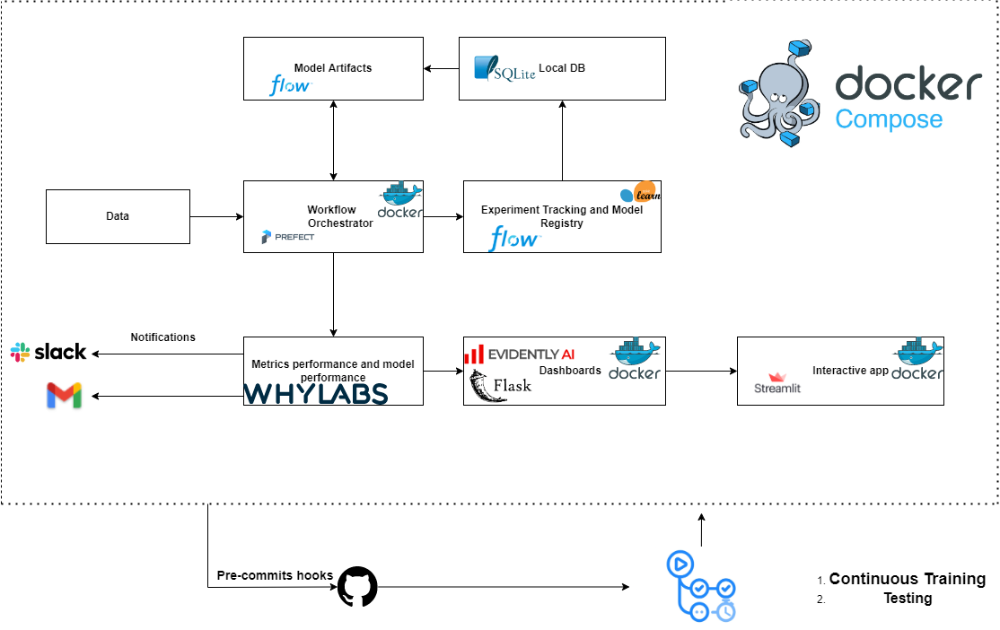
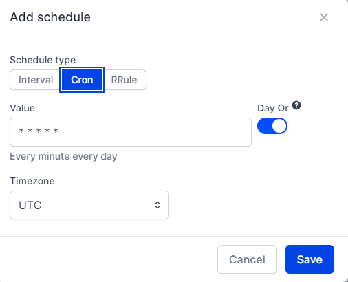
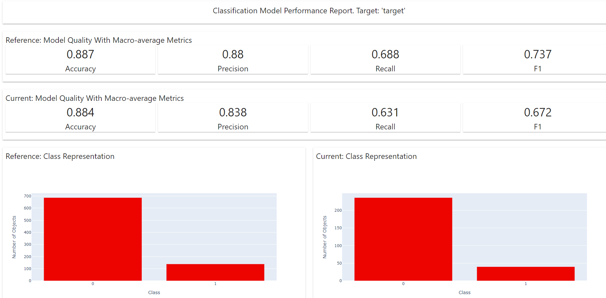
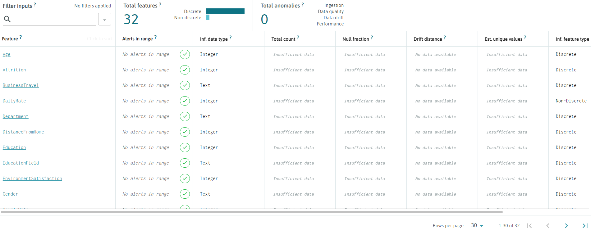
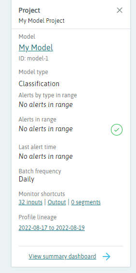
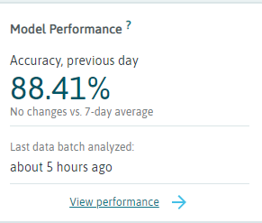

[](https://code.visualstudio.com/)
[](https://pandas.pydata.org/)
[](https://www.python.org/)
[](https://scikit-learn.org/)
[](https://prefect.io)
[](https://www.docker.com)
[](https://mlflow.org)
[](https://flask.com)
[](https://github.com/PyCQA/pylint)

## Final Project
- [Problem Explanation](#problem-explanation)
  - [Diagram](#diagram)
  - [Reproducibility](#reproducibility)
- [Step by Step](#step-by-step)
- [Enviroment](#enviroment)
  - [Create a conda enviroment for the project with python=3.9](#create-a-conda-enviroment-for-the-project-with-python39)
  - [Active the enviroment](#active-the-enviroment)
  - [Install the dependencies](#install-the-dependencies)
- [Model: Classification model that predict if an employee is leaving the company.](#model-classification-model-that-predict-if-an-employee-is-leaving-the-company)
  - [Dataset: IBM HR Analytics Employee Attrition & Performance](#dataset-ibm-hr-analytics-employee-attrition--performance)
  - [Download dataset with the following command:](#download-dataset-with-the-following-command)
  - [Working on model.ipynb](#working-on-modelipynb)
    - [Install ipython kernel](#install-ipython-kernel)
- [Tracking Experiment with Mlflow](#tracking-experiment-with-mlflow)
  - [Model Register](#model-register)
- [Orchestration of the project](#orchestration-of-the-project)
  - [Install prefect](#install-prefect)
  - [Authenticating with Prefect Cloud (Optional)](#authenticating-with-prefect-cloud-optional)
  - [Start orion UI](#start-orion-ui)
- [Deployment](#deployment)
  - [Build the deployment](#build-the-deployment)
  - [Apply the deployment](#apply-the-deployment)
  - [Work queues and agents](#work-queues-and-agents)
  - [Create a Workflow in the UI](#create-a-workflow-in-the-ui)
  - [Start an agent](#start-an-agent)
  - [Schedule the deployment](#schedule-the-deployment)
- [Monitoring](#monitoring)
  - [Evidently](#evidently)
  - [Install evidently](#install-evidently)
  - [Dashboard for classification report](#dashboard-for-classification-report)
  - [Results](#results)
  - [Whylogs](#whylogs)
  - [Install whylogs](#install-whylogs)
  - [Get your API key](#get-your-api-key)
  - [First approach: Connect dataset](#first-approach-connect-dataset)
  - [Results](#results-1)
  - [Classifier Report](#classifier-report)
  - [Generate performance report](#generate-performance-report)
  - [Results](#results-2)
  - [Activate Presets](#activate-presets)
- [Tests](#tests)
  - [Configure Tests](#configure-tests)
- [Linting and Formatting](#linting-and-formatting)
  - [Intall Pylint](#intall-pylint)
  - [Lint the code](#lint-the-code)
  - [Runs Results](#runs-results)
  - [View Results in Visual Studio Code](#view-results-in-visual-studio-code)
  - [Add `.pylintrc` file](#add-pylintrc-file)
  - [Formatting with black and isort](#formatting-with-black-and-isort)
  - [Add Black to pyproject.toml](#add-black-to-pyprojecttoml)
  - [Apply Isort](#apply-isort)
  - [Add Isort to pyproject.toml](#add-isort-to-pyprojecttoml)
- [Git pre-commits hooks](#git-pre-commits-hooks)
  - [Install pre-commit](#install-pre-commit)
  - [See pre-commit hooks examples in the root of the project (Optional)](#see-pre-commit-hooks-examples-in-the-root-of-the-project-optional)
  - [Create a sample config file with pre-commit](#create-a-sample-config-file-with-pre-commit)
  - [Create a yaml file with pre-commit settings](#create-a-yaml-file-with-pre-commit-settings)
  - [Add pre-commit to the .git folder](#add-pre-commit-to-the-git-folder)
  - [For one of my commits, I've got the following result:](#for-one-of-my-commits-ive-got-the-following-result)
  - [You can see all the hooks that pre-commit can run at the following link:](#you-can-see-all-the-hooks-that-pre-commit-can-run-at-the-following-link)
  - [Isort pre-commit hook](#isort-pre-commit-hook)
  - [Black pre-commit hook](#black-pre-commit-hook)
  - [Pylint pre-commit hook](#pylint-pre-commit-hook)
  - [Pytest pre-commit hook](#pytest-pre-commit-hook)
- [Makefiles and Make](#makefiles-and-make)
  - [Install make with the following command:](#install-make-with-the-following-command)
  - [Example:](#example)
  - [Run make with the following command:](#run-make-with-the-following-command)
- [Flask app: Evidently](#flask-app-evidently)
  - [Install Flask](#install-flask)
  - [Create a Flask app](#create-a-flask-app)
- [Streamlit app](#streamlit-app)
  - [Install Streamlit](#install-streamlit)
  - [Model that we'll use](#model-that-well-use)
  - [Load the model](#load-the-model)
  - [Run the app](#run-the-app)

# Problem Explanation
Imagine that you're working on a company that want to predict if an employee is leaving or not the company based on several factors like age, salary, etc.

The main focus of this project is to build a model to predict it, register it in a register service and deploy it.

## Diagram

## Reproducibility
If you want to reproduce the results of this project, run the following commands:

```
pip install -r requirements.txt
python model.py
make up
```
# Step by Step
Follow the steps below to reproduce the problem and build the model.
# Enviroment
## Create a conda enviroment for the project with python=3.9
```
conda create -n project_enviroment python=3.9
```
## Active the enviroment
```
conda activate project_enviroment
```
## Install the dependencies
```
pip install -r requirements.txt
```
# Model: Classification model that predict if an employee is leaving the company.
## Dataset: IBM HR Analytics Employee Attrition & Performance
Download dataset [here](https://www.kaggle.com/datasets/pavansubhasht/ibm-hr-analytics-attrition-dataset)
## Download dataset with the following command:
```
wget https://www.kaggle.com/datasets/pavansubhasht/ibm-hr-analytics-attrition-dataset?resource=download
```
## Working on [model.ipynb](notebooks/model.ipynb)
### Install ipython kernel
```
conda install -n project_enviroment ipykernel --update-deps --force-reinstall
```

# Tracking Experiment with Mlflow

Run the following command in your terminal to track the experiment in your local machine:

```
mlflow ui --backend-store-uri sqlite:///mydb.sqlite
```
That command create a database file called mydb.sqlite in the current directory that'll be used to store the experiment data.

Add this code to your notebook to track the experiment in your local machine using a SQLite database:

```
import mlflow


mlflow.set_tracking_uri('sqlite:///mydb.sqlite')
```

And start a run with:

```
mlflow.start_run()
```
## Model Register
I'm using a sklearn library, mlflow provides a way to register the model with the following command:
```
  #Model Register
  mlflow.sklearn.log_model(
        sk_model = logreg,
        artifact_path='models/logreg',
        registered_model_name='sk-learn-logreg-model'
  )
```

# Orchestration of the project
I'm going to use [Prefect==2.0.4](https://prefect.io/) to orchestrate the project.
## Install prefect
```
conda install prefect -c conda-forge
```
## Authenticating with Prefect Cloud (Optional)
```
prefect auth login --key <YOUR-KEY>
```
## Start orion UI
```
prefect orion start
```

# Deployment
See the options wit the following command:

```
 prefect deployment build --help
```
## Build the deployment
```
prefect deployment build .\model.py:applying_model --name Project-Deployment --tag MLOps
```
## Apply the deployment
```
prefect deployment apply applying_model-deployment.yaml
```
## Work queues and agents
We can't run the deployment from the UI yet. We nned a work queue and an agent to run the deployment.

Work queues and agents are the mechanisms by which the Prefect API orchestrates deployment flow runs in remote execution environments.

Work queues let you organize flow runs into queues for execution. Agents pick up work from queues and execute the flows
## Create a Workflow in the UI

## Start an agent
```
prefect agent start -t tag where tag is the tag you used to build the deployment.
```
Now, when you run a deployment with the `-t tag` option, the agent will pick up the work from the queue and execute the flows.
## Schedule the deployment
- Go to the UI
- Select `Add Schedule`

- I'm going to select `Cron` with a value of `0 0 * * *` that means every day at 12:00 AM.
- `Timezone` is important, so, be sure to select the correct timezone.

# Monitoring
I'm going to use [Evidently](https://evidentlyai.com/) and [Whylogs](https://github.com/whylabs/whylogs)to monitor the experiment.
## Evidently
## Install evidently
You can install it with the following command:
```
pip install evidently
```
## Dashboard for classification report
Classification Performance report evaluates the quality of a classification model. It works both for binary and multi-class classification. If you have a probabilistic classification, refer to a separate report.
This report can be generated for a single model, or as a comparison. You can contrast your current production model performance against the past or an alternative model.

[More info here](https://docs.evidentlyai.com/reports/classification-performance)

## Results
Using train data and valid data to evaluate the model I've created the following dashboard:

You can see the resuls in the [`dashboard`](dashboards/df_model_performance.html) folder.
## Whylogs
## Install whylogs
```
pip install "whylogs<1.0"
```
We're installing this version because the platform doesn't yet support v1.
## Get your API key
Go to [whylogs.com](https://whylogs.com/) and create an account, then go to your profile and click on the `API` tab.
## First approach: Connect dataset
As a first approach, we can connect the dataset to the experiment.

I've used the following command to connect the dataset to the experiment:
```
import whylogs as why
from whylogs.app import Session
from whylogs.app.writers import WhyLabsWriter

writer = WhyLabsWriter("", formats=[])
    session = Session(project="model-1", pipeline="mlops-project-pipeline", writers=[writer])

with session.logger(tags={"datasetId": "model-1"}) as ylog:
        ylog.log_dataframe(df)
```
## Results

## Classifier Report
First: Make sure that you have selected `Classification` model in your Whylabs Project.

## Generate performance report
```
    scores = [max(p) for p in logreg.predict_proba(X_val)]
    with session.logger(tags={"datasetId": "model-1"}, dataset_timestamp = datetime.now()) as ylog:
        ylog.log_metrics(
            targets = list(y_val),
            predictions = list(y_pred),
            scores = scores,
            model_type = ModelType.CLASSIFICATION,
            target_field="Attrition",
            prediction_field="prediction",
            score_field = "Normalized Prediction Probability",
        )
```
## Results

## Activate Presets
We can activate some `Preset monitors` to monitor different part of the experiment.

You can receive alerts from these `Preset monitors`, in my case I've enabled:

# Tests
I'll use Pytest to test the model.

Install pytest with the following command:
```
pip install pytest
```
## Configure Tests
1. Go to `tests` extension in VS Code and select a folder that contains the tests, in this case `tests/`.
2. Select `Pytest` as the test runner.

# Linting and Formatting
I'm going to use [Pylint](https://black.readthedocs.io/en/stable/) to lint and format the code.
## Intall Pylint
Use this command to install pylint:
```
pip install pylint
```
## Lint the code
You can lint your python file as follows:
```
pylint my_file.py
```
In my case, `pylint model.py`.

## Runs Results
1. In the first time I'd obtained a score 5.23/10 (very bad).
2. Score of 5.88/10 (still bad).
3. Score of 6.47/10 (quite good).
4. After creating [pyproject.toml](pyproject.toml) my score raises to 8.35/10 (very good).
5. Now my score is 9.76/10 (excellent).
## View Results in Visual Studio Code
1. Press `Ctrl + Shift + P` and then type `linting` and select `Pylint`.
2. Run linting with `Ctrl + Shift + P` and `Run linting`.
## Add `.pylintrc` file
You can add a `.pylintrc` file in the root of the project to configure pylint.

I'm going to use `pyproject.toml` instead.
## Formatting with black and isort
Install black and isort with the following command:
```
pip install black isort
```
Before you run black, you can check the changes that will do with the following command:
```
black --diff my_file.py
```
After that, you can run black with the following command:
```
black my_file.py
```
## Add Black to pyproject.toml
You can add some configurations to `pyproject.toml`, in my case:
```
[tool.black]
line-length = 120
target-version = ['py39']
skip-string-normalization = true
```
where:
- `line-length` is the maximum length of a line.
- `target-version` is the version of python that you want to use.
- `skip-string-normalization` is a boolean that indicates if you want to skip string normalization.
## Apply Isort
You can apply isort with the following command:
```
isort my_file.py
```
## Add Isort to pyproject.toml
Add the following configurations to `pyproject.toml`:
```
multi_line_output = 3
length_sort = true
order_by_type = true
```
where:
- `multi_line_output` is the number of lines that will be used to output a multiline string.
- `length_sort` is a boolean that indicates if you want to sort by length.
- `order_by_type` is a boolean that indicates if you want to order by type.

# Git pre-commits hooks

I'm going to install `pre-commit` library. [More info here](https://pre-commit.com/).
## Install pre-commit
```
pip install pre-commit
```
## See pre-commit hooks examples in the root of the project (Optional)
1. Go to `.git/hooks` folder and select `pre-commit`.
2. Open `pre-commit.sample` file and see the examples.
3. Example content:
```
#!/bin/sh
#
# An example hook script to verify what is about to be committed.
# Called by "git commit" with no arguments.  The hook should
# exit with non-zero status after issuing an appropriate message if
# it wants to stop the commit.
#
# To enable this hook, rename this file to "pre-commit".

if git rev-parse --verify HEAD >/dev/null 2>&1
then
	against=HEAD
else
	# Initial commit: diff against an empty tree object
	against=$(git hash-object -t tree /dev/null)
fi

# If you want to allow non-ASCII filenames set this variable to true.
allownonascii=$(git config --type=bool hooks.allownonascii)

# Redirect output to stderr.
exec 1>&2

# Cross platform projects tend to avoid non-ASCII filenames; prevent
# them from being added to the repository. We exploit the fact that the
# printable range starts at the space character and ends with tilde.
if [ "$allownonascii" != "true" ] &&
	# Note that the use of brackets around a tr range is ok here, (it's
	# even required, for portability to Solaris 10's /usr/bin/tr), since
	# the square bracket bytes happen to fall in the designated range.
	test $(git diff --cached --name-only --diff-filter=A -z $against |
	  LC_ALL=C tr -d '[ -~]\0' | wc -c) != 0
then
	cat <<\EOF
Error: Attempt to add a non-ASCII file name.

This can cause problems if you want to work with people on other platforms.

To be portable it is advisable to rename the file.

If you know what you are doing you can disable this check using:

  git config hooks.allownonascii true
EOF
	exit 1
fi

# If there are whitespace errors, print the offending file names and fail.
exec git diff-index --check --cached $against --
```
## Create a sample config file with pre-commit
Type the following command to create a sample config file:
```
pre-commit sample-config
```
## Create a yaml file with pre-commit settings
Type the following command to create a yaml file with pre-commit settings:
```
pre-commit sample-config >.pre-commit-config.yaml
```
## Add pre-commit to the .git folder
Type the following command to add pre-commit to the .git folder:
```
pre-commit install
```
## For one of my commits, I've got the following result:

## You can see all the hooks that pre-commit can run at the following link:
[https://pre-commit.com/hooks.html](https://pre-commit.com/hooks.html)
## Isort pre-commit hook
Add the following configuration to `.pre-commit-config.yaml`:
```
  - repo: https://github.com/pycqa/isort
    rev: 5.10.1
    hooks:
      - id: isort
        name: isort (python)
```
## Black pre-commit hook
Add the following configuration to `.pre-commit-config.yaml`:
```
  repos:
-   repo: https://github.com/psf/black
    rev: stable
    hooks:
    - id: black
      language_version: python3.9
```
## Pylint pre-commit hook
Add the following configuration to `.pre-commit-config.yaml`:
```
- repo: local
  hooks:
    - id: pylint
      name: pylint
      entry: pylint
      language: system
      types: [python]
      args:
        [
          "-rn", # Only display messages
          "-sn", # Don't display the score
        ]
```
## Pytest pre-commit hook
```  - repo: local
    hooks:
      - id: pytest-check
        name: pytest-check
        entry: pytest
        language: system
        pass_filenames: false
        always_run: true
```

# Makefiles and Make
Make is a tool which controls the generation of executables and other non-source files of a program from the program's source files. Make gets its knowledge of how to build your program from a file called the makefile, which lists each of the non-source files and how to compute it from other files. When you write a program, you should write a makefile for it, so that it is possible to use Make to build and install the program.

## Install make with the following command:
```
sudo apt install make
```
or if you are using Windows, you can install make with the following command (as a administrator):
```
choco install make
```
where `choco` is the command to install chocolatey packages.

## Example:
```
test:
	echo test

other_thing:
	echo other thing

run: test other_thing
	echo run
```
## Run make with the following command:
```
make run
```
# Flask app: Evidently
I'm going to put the html generated by Evidently in a Flask app.
## Install Flask
Install Flask with the following command:
```
pip install flask
```
## Create a Flask app
```
from flask import Flask, render_template

app = Flask (__name__, template_folder='dashboards')

@app.route('/')
def evidently():
    return render_template('df_model_performance.html')

if __name__ == '__main__':
    app.run(debug=True, host = '0.0.0.0', port = 9696)
```
where:
1. `dashboards` is the folder where the html files are located.
2. render_template is a function that takes the name of the html file and returns the html code.
3. I've selected port = 9696.

# Streamlit app
We can make a Streamlit app using our model.
## Install Streamlit
Install Streamlit with the following command:
```
pip install streamlit
```
## Model that we'll use
We'll use the last model we trained. This model will be at `models` folder.
## Load the model
Load the model with the following command:
```
def load_model():
    model = 'models/pipeline.bin'

    with open(model, 'rb') as f_in:
        pipeline = pickle.load(f_in)

    return pipeline
pipeline = load_model()
```
## Run the app
Run the app with the following command:
```
streamlit run streamlit/streamlit_app.py
```
where `streamlit_app.py` is the name of the file.
